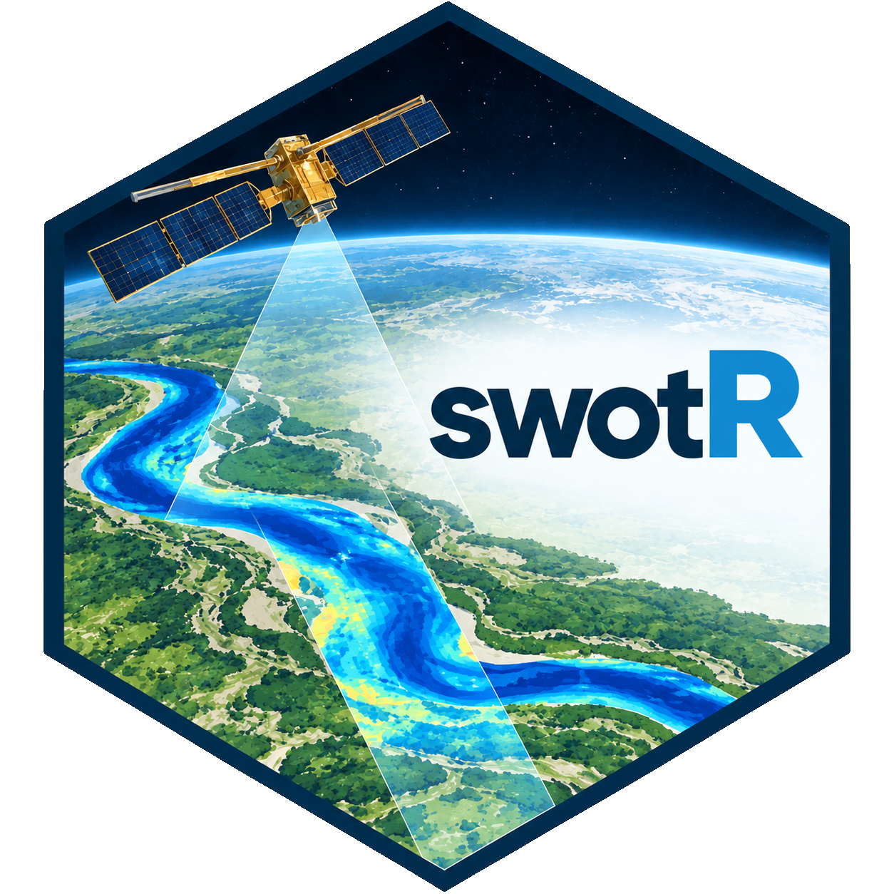

# swotR

<!-- badges: start -->

<!-- badges: end -->

### R package for downloading and processing SWOT river data

This package allows to download and spatially filter reaches and nodes from the SWORD river netword data ([Altenau et al. 2021](https://doi.org/10.1029/2021WR030054)). Then, it allows to use the reach or node ids from the network to download and filter [SWOT riverSP data](https://podaac.jpl.nasa.gov/dataset/SWOT_L2_HR_RiverSP_2.0) on water surface elevation and other information provided by the SWOT riverSP product. The access is done via the NASA's [Hydrocron API](https://podaac.github.io/hydrocron/).
